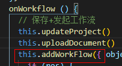
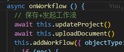
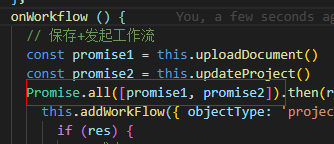

## 1. data 中定义的属性是响应式的
> 原因： `Vue`会在初始化实例时对`property`执行`getter/setter`转化

## 2. vue 无法检测对象 property 的添加或移除
> 原因：由于`JavaScript（ES5）`的限制，Vue.js 不能检测到对象属性的添加或删除。因为 Vue.js 在初始化实例时将属性转为`getter/setter`，所以属性必须在`data`对象上才能让 Vue.js 转换它，才能让它是响应的。

```js
// 解决办法：
// 动态添加 - Vue.set
Vue.set(vm.obj, propertyName, newValue)
// 动态添加 - vm.$set
vm.$set(vm.obj, propertyName, newValue)
// 动态添加多个
// 代替 Object.assign(this.obj, { a: 1, b: 2 })
this.obj = Object.assign({}, this.obj, { a: 1, b: 2 })
// 动态移除 - Vue.delete
Vue.delete(vm.obj, propertyName)
// 动态移除 - vm.$delete
vm.$delete(vm.obj, propertyName)
```

## 3. Vue 不能检测通过数组索引直接修改一个数组项
> 原因：由于 JavaScript 的限制，Vue 不能检测数组和对象的变化；尤雨溪 - 性能代价和获得用户体验不成正比。

```js
// 解决办法：
// Vue.set
Vue.set(vm.items, indexOfItem, newValue)
// vm.$set
vm.$set(vm.items, indexOfItem, newValue)
// Array.prototype.splice
vm.items.splice(indexOfItem, 1, newValue)
```

## 4. `Object.defineProperty()` 可以监测数组的变化
> Object.defineProperty() 可以监测数组的变化。但对数组新增一个属性（index）不会监测到数据变化，因为无法监测到新增数组的下标（index），删除一个属性（index）也是。
```js
// 场景：
var arr = [1, 2, 3, 4]
arr.forEach(function(item, index) {
    Object.defineProperty(arr, index, {
    set: function(value) {
      console.log('触发 setter')
      item = value
    },
    get: function() {
      console.log('触发 getter')
      return item
    }
  })
})
arr[1] = '123'  // 触发 setter
arr[1]          // 触发 getter 返回值为 "123"
arr[5] = 5      // 不会触发 setter 和 getter
```

## 5. Vue 不能监测直接修改数组长度的变化
>原因：由于 JavaScript 的限制，Vue 不能检测数组和对象的变化；尤雨溪 - 性能代价和获得用户体验不成正比。

```js
// 场景：
var vm = new Vue({
  data: {
    items: ['a', 'b', 'c']
  }
})
vm.items.length = 2 // 不是响应性的
// 解决办法：
vm.items.splice(newLength)
```

## 6. 在异步更新执行之前操作 DOM 数据不会变化
>原因：Vue 在更新 DOM 时是异步执行的。只要侦听到数据变化，Vue 将开启一个队列，并缓冲在同一事件循环中发生的所有数据变更。如果同一个`watcher`被多次触发，只会被推入到队列中一次。这种在缓冲时去除重复数据对于避免不必要的计算和 DOM 操作是非常重要的。然后，在下一个的事件循环`tick`中，Vue 刷新队列并执行实际 (已去重的) 工作。Vue 在内部对异步队列尝试使用原生的 `Promise.then`、`MutationObserver` 和 `setImmediate`，如果执行环境不支持，则会采用 `setTimeout(fn, 0)` 代替。

```html
<!-- 场景 -->
<div id="example">{{message}}</div>
```
```js
var vm = new Vue({
  el: '#example',
  data: {
    message: '123'
  }
})
vm.message = 'new message' // 更改数据
vm.$el.textContent === 'new message' // false
vm.$el.style.color = 'red' // 页面没有变化

// 解决办法
var vm = new Vue({
  el: '#example',
  data: {
    message: '123'
  }
})
vm.message = 'new message' // 更改数据
//使用 Vue.nextTick(callback) callback 将在 DOM 更新完成后被调用
Vue.nextTick(function () {
  vm.$el.textContent === 'new message' // true
  vm.$el.style.color = 'red' // 文字颜色变成红色
})
```

## 7. 异步更新带来的数据响应的误解

```html
<!-- 页面显示：我更新啦！ -->
<div id="example">{{message.text}}</div>
```
```js
var vm = new Vue({
  el: '#example',
  data: {
    message: {},
  }
})
vm.$nextTick(function () {
  this.message = {}
  this.message.text = '我更新啦！'
})
```

`data`对象中只是声明了一个`message`空对象，并不具有`text`属性，所以该`text`属性是不具有响应式特性的。但模板切切实实已经更新了，这又是怎么回事呢？

>原因：`Vue.js`的 DOM 更新是异步的，即当`setter`操作发生后，指令并不会立马更新，指令的更新操作会有一个延迟，当指令更新真正执行的时候，此时 text 属性已经赋值，所以指令更新模板时得到的是新值。

模板中每个指令/数据绑定都有一个对应的 watcher 对象，在计算过程中它把属性记录为依赖。之后当依赖的 setter 被调用时，会触发 watcher 重新计算 ，也就会导致它的关联指令更新 DOM。

具体流程如下：
* 执行 `this.message = {};` 时， `setter` 被调用。
* Vue.js 追踪到 `message` 依赖的 `setter` 被调用后，会触发 `watcher` 重新计算。
* `this.message.text = '我更新啦！';` 对 `text` 属性进行赋值。
* 异步回调逻辑执行结束之后，就会导致它的关联指令更新 DOM，指令更新开始执行。

所以真正的触发模版更新的操作是 this.message = {};这一句引起的，因为触发了 setter，所以单看上述例子，具有响应式特性的数据只有 message 这一层，它的动态添加的属性是不具备的。

## `@click.capture.stop="myMethod()"` 仅响应myMethod方法

## 8. async-await 与 promise.all()
### 问题场景：
一个方法中有多个异步方法，且最后一个方法需要前几个异步方法的结果。

比如：项目中创建工作流时，需要调用更新后的项目model和上传的文档信息，如下：



### 解决方案：

1. 可使用async-await ：



addWorkFlow方法会等待前两个方法的执行结果再执行。关于执行顺序可查看：[async/await 执行顺序详解](https://www.cnblogs.com/lpggo/p/8127604.html)

2. 可使用promise.all()。<b>建议使用promise.all()</b>



多个await命令的异步操作，如果不存在依赖关系（后面的await不依赖前一个await返回的结果），用Promise.all()让它们同时触发。由于async-await是依次执行，而promise.all()是同时执行，可提高效率。